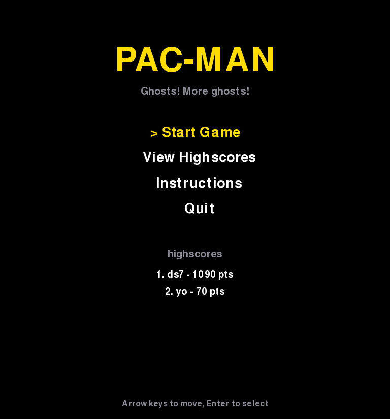
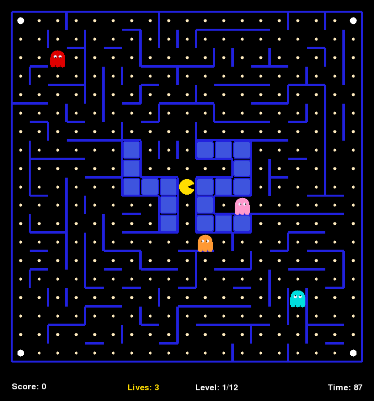

*This project has been created as part of the 42 curriculum by dlaktaf, dsom.*

# Pac-Man — Ghosts! More ghosts!

A complete, playable re-creation of the classic arcade game **Pac-Man**,
written in Python on top of a deliberately minimal, **MLX-equivalent**
drawing layer (backed by [pygame-ce](https://pyga.me/)) and a modular,
object-oriented architecture.





## Description

The goal of this project is to rebuild Pac-Man with a clean, reusable code
base. The player navigates a maze, eats every pacgum, grabs super-pacgums to
turn the ghosts edible, and clears level after level — each one a fresh maze
produced by an externally assigned *A-Maze-ing* package.

Key features:

- Custom configuration through a **JSON-with-comments** file.
- **Robust error handling** — bad arguments or faulty configs never crash the
  game and never print a Python traceback.
- Levels generated by the assigned external **`mazegenerator`** package,
  used *as-is*.
- A **persistent top-10 highscore** system stored on disk.
- A polished **UI**: main menu, gameplay view, pause menu, highscores,
  instructions, and win/game-over screens with name entry.
- A **cheat mode** for peer review (invincibility, freeze, skip, lives,
  speed).
- A graphical layer restricted to **MLX-equivalent operations** only
  (see [Graphical library](#graphical-library-mlx-equivalence)).

## Instructions

### Requirements

- Python **3.10+**
- The dependencies listed in `requirements.txt` (mainly `pygame-ce`).
- The assigned `mazegenerator` package, **version 2.1.0** (vendored untouched
  in `mazegenerator/`, and shipped as
  `mazegenerator-2.1.0-py3-none-any.whl` so it can be re-installed during the
  peer review).

The package is used strictly as-is — `mazegenerator/` is byte-identical to the
assigned wheel — so it is excluded from `flake8` and `mypy` in `setup.cfg`,
and `make lint` is clean. Linting the vendored files explicitly (for instance
`flake8 */*.py`, which bypasses that exclusion) reports style warnings that
belong to the assigned package, not to our code.

### Install & run

```bash
make install            # creates .venv/ and installs requirements.txt in it
make run                # launches: .venv/bin/python pac-man.py config.json
# or directly, with your own interpreter:
python3 pac-man.py config.json
```

The program takes **exactly one argument**: the configuration file. Its name
does not matter (`config.json`, `defense.json`, `whatever` — all work); what
matters is that its content is JSON, so the file is accepted or rejected on
what it contains, never on its extension.

`make install` builds a local virtualenv in `.venv/` so the project's
dependencies never conflict with packages already installed on the machine.
Every other target reuses that interpreter automatically once it exists, and
falls back to the system `python3` otherwise (`make run PYTHON=python3.12`
overrides it).

Other Makefile targets:

| Target          | Purpose                                            |
|-----------------|----------------------------------------------------|
| `make install`  | Create `.venv/` and install dependencies           |
| `make run`      | Run the game (`CONFIG=other.json` to override)     |
| `make debug`    | Run under `pdb`                                     |
| `make lint`     | Run `flake8` + `mypy`                               |
| `make lint-strict` | Run `flake8` + `mypy --strict`                  |
| `make test`     | Run the `pytest` unit tests                        |
| `make clean`    | Remove caches and artifacts                        |
| `make fclean`   | `clean` + remove `build/`, `dist/` and `.venv/`    |

### Controls

| Action            | Keys                                  |
|-------------------|---------------------------------------|
| Move              | Arrow keys or `W` `A` `S` `D`         |
| Pause / resume    | `Esc`                                 |
| Menu navigation   | Arrow keys + `Enter`                  |
| **Cheats** F1     | Toggle invincibility                  |
| **Cheats** F2     | Freeze ghosts                         |
| **Cheats** F3     | Skip current level                    |
| **Cheats** F4     | Add a life                            |
| **Cheats** F5     | Cycle player speed (1x / 1.5x / 2x)   |

## Configuration

The configuration file is **JSON extended with comments**: lines (or trailing
parts of lines) starting with `#` or `//` are ignored, and `/* … */` blocks
are supported. Comment markers inside string values are preserved.

Every key is optional and validated; missing or invalid values fall back to a
safe default (and out-of-range values are clamped) so the game never crashes.
Unknown keys are ignored.

| Key                       | Default            | Meaning                                  |
|---------------------------|--------------------|------------------------------------------|
| `highscore_filename`      | `highscores.json`  | Where highscores are stored              |
| `lives`                   | `3`                | Starting lives (1–99)                    |
| `seed`                    | `42`               | Seed of the **first** level              |
| `level_max_time`          | `90`               | Seconds per level (10–3600)              |
| `points_per_pacgum`       | `10`               | Score per pacgum                         |
| `points_per_super_pacgum` | `50`               | Score per super-pacgum                   |
| `points_per_ghost`        | `200`              | Score per edible ghost eaten             |
| `edible_duration`         | `7.0`              | Seconds ghosts stay edible               |
| `ghost_respawn_time`      | `5.0`              | Seconds before an eaten ghost returns    |
| `player_speed`            | `6.0`              | Player speed (cells/second)              |
| `ghost_speed`             | `5.0`              | Ghost speed (cells/second)               |
| `pacgum`                  | `0`                | Pacgums per level (`0` = fill every corridor) |
| `levels` / `level`        | 10 growing mazes   | Array of `{ "width", "height" }` objects |

The game always offers **at least 10 levels**: if fewer are configured, the
list is padded automatically with increasingly large mazes. Maze dimensions
are clamped to `[15, 41]` cells.

Both the plural `levels` and the singular `level` spelling suggested by the
subject are accepted. `pacgum` caps how many pacgums are placed per level and
spreads them evenly over the corridors; `0` (the default) fills every corridor.
The four super-pacgums are always placed in the four corners, on top of that
budget.

## Highscore

Highscores are kept in a single JSON file (`highscore_filename`) as a list of
`{ "name": str, "score": int }` objects. The `HighScores` class:

- Loads scores at startup and saves them whenever a new score is added.
- Keeps only the **top 10**, sorted by descending score.
- Sanitizes names: ASCII alphanumeric characters and spaces only, max 10
  chars (both while typing and on load, so a hand-edited file stays valid).
- Coerces scores to non-negative integers.
- Is **robust to file errors**: a missing or corrupted file simply yields an
  empty table instead of crashing.

**Why a JSON file?** It is human-readable, trivially portable with the game,
diff-friendly, and needs no external database — a perfect fit for a small,
self-contained arcade game and for an easy review.

## Graphical library (MLX equivalence)

The subject allows a graphical library only if **every function used has an
equivalent in MLX**. We therefore never call pygame's high-level helpers
(`pygame.draw.*`, sprites, transforms, alpha surfaces, the mixer…). Instead,
`pacman/canvas.py` exposes a small `Canvas` / `Window` API that mirrors the MLX
surface one-to-one, and the rest of the game may use nothing else:

| MLX function                       | Our API                                     |
|------------------------------------|---------------------------------------------|
| `mlx_init` / `mlx_new_window`      | `Window(width, height, title)`              |
| `mlx_new_image`                    | `Canvas.new_image(width, height)`           |
| `mlx_put_pixel`                    | `Canvas.put_pixel(x, y, color)`             |
| direct image-buffer row write      | `Canvas.pixel_run(x, y, length, color)`     |
| `mlx_image_to_window`              | `Canvas.put_image(image, x, y)`             |
| `mlx_put_string`                   | `Canvas.put_string(...)`                    |
| `mlx_key_hook` / `mlx_close_hook`  | `Window.poll_events()` + key constants      |
| `mlx_loop` (one iteration)         | `Window.tick(fps)` + `Window.flush()`       |
| `mlx_terminate`                    | `Window.close()`                            |

Every shape the game draws — lines, rectangles, rounded blocks, discs,
ellipses, filled polygons — is **rasterised by us** in `canvas.py` on top of
those primitives (Bresenham for segments, scanline spans for discs, ellipses
and polygons), exactly as one does by hand on an MLX image buffer. Horizontal
spans are committed as a single memory write rather than one call per pixel,
which is the same optimisation an MLX program makes when it writes directly
into the buffer returned by `mlx_get_data_addr`.

Two consequences worth noting:

- There is **no alpha blending** anywhere (MiniLibX has none), so the pause
  screen uses an opaque panel instead of a translucent overlay.
- Rendering follows the MLX workflow: the static part of a level (walls plus
  the pacgums still on the board) is rasterised **once** into an off-screen
  image and copied to the window each frame; only Pac-Man, the ghosts, the
  pulsing super-pacgums and the HUD are redrawn per frame. An eaten pacgum is
  erased from the level image in place. Even the largest maze stays far above
  60 FPS.

## Maze Generation

Maze generation is delegated **entirely** to the assigned `mazegenerator`
package (**version 2.1.0**, shipped here as
`mazegenerator-2.1.0-py3-none-any.whl` and vendored untouched in
`mazegenerator/`); we do not generate mazes ourselves. Our `pacman/maze.py`
module is a thin **adapter** that consumes the package's public interface
as-is:

- We instantiate `MazeGenerator(size=(width, height), perfect=False, seed=...)`.
- `perfect=False` is required, as stated by the subject: in 2.1.0 it also makes
  the generator braid the maze (remove dead-ends), which is what produces
  Pac-Man-compatible corridors.
- The **first** level uses the configured fixed `seed`; subsequent levels pass
  `seed=0` for a fully random maze each time.
- We read the package's `maze` grid (a 4-bit wall encoding) plus the entry/exit
  metadata, then derive everything the game needs: walkable cells, the player
  spawn (centre), the four ghost/super-pacgum corners and the pacgums.
- The `pacgum` budget, when configured, is applied on top of the generated
  grid; otherwise every corridor cell receives a pacgum.
- Generation is wrapped in defensive error handling (and a raised recursion
  limit, kept for older generator versions that carved recursively) so a
  generator failure is reported cleanly instead of crashing: it is turned
  into a `RuntimeError`, caught by the application, and the player is sent
  back to the main menu with an on-screen message — whether it happens when
  starting a game or when building the next level mid-run.

The adapter targets the package's interface, never the opposite: if the
assigned package is re-installed during the peer review, only
`pacman/maze.py` would need to follow its API.

A passage between two cells is considered open only when **both** cells agree,
which guarantees symmetric, two-way corridors and fully reachable levels.

## Implementation

- **Language/stack:** Python 3.10+, object-oriented design, and an
  MLX-equivalent drawing layer (`pacman/canvas.py`) backed by pygame-ce.
- **Rendering:** every shape is rasterised by us from `put_pixel`-level
  primitives; the level is cached as an off-screen image and blitted per
  frame (see [Graphical library](#graphical-library-mlx-equivalence)).
- **Movement:** entities move smoothly from cell to cell using an
  interpolation `progress`, keeping motion aligned to the corridors.
- **Ghost AI:** four personalities (direct chaser, ambusher, erratic, shy
  retreater); ghosts flee while edible and return home as "eyes" when eaten.
- **Rules:** scoring, lives, per-level timer, power-pellet window and level
  progression are centralized in the `Game` class.
- **Quality:** the code is fully type-hinted (passes `mypy`), `flake8`-clean,
  documented with docstrings, and covered by `pytest` unit tests.

## General Software Architecture

```
pac-man.py            Entry point: argument parsing + clean error handling
pacman/
├── constants.py      Wall bits, directions, colours, layout constants
├── config.py         JSON-with-comments loading, validation, clamping
├── canvas.py         MLX-equivalent layer: window, images, put_pixel, text
├── highscore.py      Persistent top-10 highscore table
├── maze.py           Adapter over the mazegenerator package + level layout
├── entities.py       Entity base, Player, Ghost (smooth motion + AI)
├── game.py           Game rules: score, lives, timer, collisions, cheats
├── render.py         Maze, entities and HUD drawing (uses canvas only)
└── app.py            Window, main loop and screen state machine
```

Relationships: `app.App` owns a `canvas.Window`, a `render.Renderer` and a
`game.Game`, which owns a `maze.Maze`, an `entities.Player` and four
`entities.Ghost`. `render.Renderer` reads the `Game`/`Maze` state and draws
through `canvas.Canvas` — the only module that touches the graphical library.
`config.Config` and `highscore.HighScores` are shared services created by
`App`.

## Project Management

The team used a lightweight Kanban + acceptance-test approach. All planning,
risk analysis, progress tracking and the test plan live in the
[`project_management/`](project_management/) directory.

## Packaging & Deployment

The game is **deployed on Itch.io** as a free, restricted (private) build, so
it can be installed and launched like a real game, with no Python required:

> **Play it:** <https://destynyle.itch.io/pacmandsomdlak>
> **Access password:** `***REMOVED***`
> Platform: Linux x86_64. Download the zip, then run `./play.sh`.

The packaging script and spec live at the repository root:

```bash
./build.sh                     # builds everything below
./dist/pac-man config.json     # test the packaged game
```

`build.sh` uses **PyInstaller** (`pacman.spec`) to bundle the code,
`config.json` and the `mazegenerator` package into a single executable, then
assembles `dist/pac-man-release/` (executable, `config.json`, a `play.sh`
launcher and `README.txt` with the in-package instructions) and zips it as
`dist/pac-man-linux.zip` — the archive uploaded to Itch.io as a **No
payments** (free), **Restricted** (private) project.

The launcher matters: the game takes exactly one argument, so a downloaded
build needs `play.sh` to supply `config.json`.

Step-by-step deployment instructions (including the optional `butler` CLI) are
in [`project_management/packaging.md`](project_management/packaging.md). Build on
the OS you target — PyInstaller does not cross-compile — and note you may be
asked to regenerate the package during the peer review (`./build.sh`).

## Resources

Classic references about the game and its ghost AI:

- The Pac-Man Dossier — Jamey Pittman (ghost behaviour reference).
- pygame-ce documentation — <https://pyga.me/docs/>.
- MLX42 API reference — <https://github.com/codam-coding-college/MLX42> (used
  to check that every graphical operation we rely on has an MLX equivalent).
- Bresenham's line algorithm and scanline polygon filling (rasterisation of
  our own drawing primitives).
- Wikipedia — *Pac-Man* (history, mechanics).

### How AI was used

AI assistance (an LLM) was used as a pair-programming aid for:
clarifying the `mazegenerator` wall-bit encoding, drafting boilerplate
(docstrings, the JSON comment-stripper, repetitive drawing code) and
suggesting the smooth cell-to-cell movement model. Every generated snippet was
read, tested and adapted by the team; design decisions (architecture, AI
behaviour, configuration schema) and the final code are our own and fully
understood. AI was **not** used to produce code we could not explain.
